# Broken Access Control:

# Cosa Sono?

---
layout: two-cols
---

# Broken Access Control

Il controllo degli accessi garantisce che gli utenti **non possano agire al di fuori dei loro permessi previsti**.

Un fallimento di questo meccanismo porta tipicamente a:

- **Divulgazione non autorizzata** di informazioni
- **Modifica o distruzione** di dati altrui
- **Esecuzione di funzioni privilegiate** senza averne il diritto

::right::

```mermaid
flowchart TD
    U([👤 Utente]) --> R{Richiesta API}
    R --> AC{Access Control Check}
    AC -->|✅ Autorizzato| D[(Database)]
    AC -->|❌ Non autorizzato| E[403 Forbidden]
    AC -->|⚠️ ASSENTE o ROTTO| D
    D --> RES([📄 Risposta])
    
    style AC fill:#ff6b6b,color:#fff
    style E fill:#51cf66,color:#fff
    style D fill:#339af0,color:#fff
```

---
layout: default
---

# OWASP Top 10:2025 — #1

  
100%

  
delle applicazioni testate presenta qualche forma di BAC

  
1.8M+

  
occorrenze rilevate nei dati raccolti

  
32.654

  
CVE correlati — il secondo numero più alto in assoluto

| Metrica | Valore |
|--------|--------|
| CWE mappate | 40 |
| Max Incidence Rate | 20,15% |
| Avg Weighted Exploit | 7,04 / 10 |
| Avg Weighted Impact | 3,84 / 10 |

  Fonte: <a href="https://owasp.org/Top10/2025/A01_2025-Broken_Access_Control/" class="text-blue-400">OWASP Top 10:2025 — A01</a>

