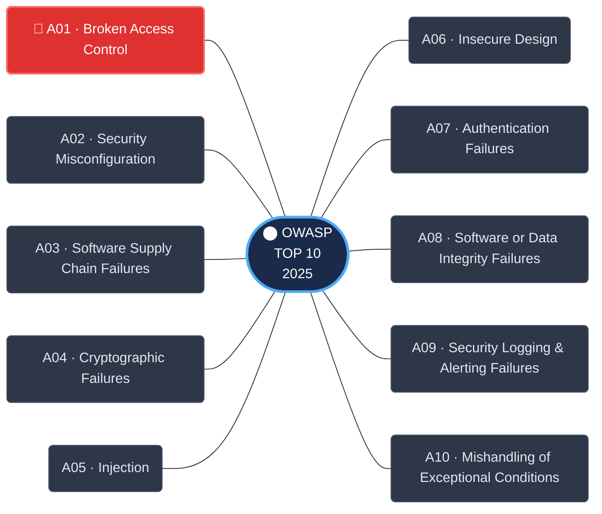
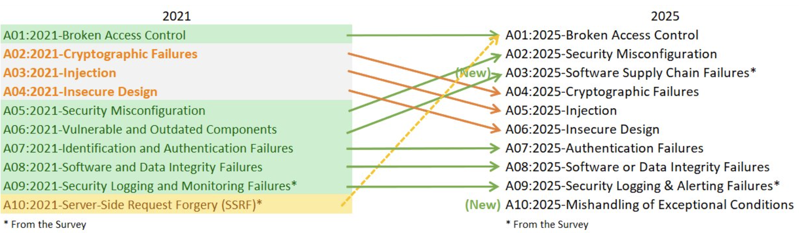

# OWASP Top 10 : 2025

```mermaid
graph LR
    A01("🔴 A01 · Broken Access Control")
    A02("A02 · Security Misconfiguration")
    A03("A03 · Software Supply Chain Failures")
    A04("A04 · Cryptographic Failures")
    A05("A05 · Injection")
    CENTER(["⬤ OWASP
TOP 10
2025"])
    A06("A06 · Insecure Design")
    A07("A07 · Authentication Failures")
    A08("A08 · Software or Data Integrity Failures")
    A09("A09 · Security Logging & Alerting Failures")
    A10("A10 · Mishandling of Exceptional Conditions")

    A01 --- CENTER
    A02 --- CENTER
    A03 --- CENTER
    A04 --- CENTER
    A05 --- CENTER
    CENTER --- A06
    CENTER --- A07
    CENTER --- A08
    CENTER --- A09
    CENTER --- A10

    style CENTER fill:#1a2a4a,color:#fff,stroke:#4dabf7,stroke-width:3px
    style A01 fill:#e03131,color:#fff,stroke:#ff6b6b,stroke-width:2px
    style A02 fill:#2d3748,color:#e2e8f0,stroke:#4a5568
    style A03 fill:#2d3748,color:#e2e8f0,stroke:#4a5568
    style A04 fill:#2d3748,color:#e2e8f0,stroke:#4a5568
    style A05 fill:#2d3748,color:#e2e8f0,stroke:#4a5568
    style A06 fill:#2d3748,color:#e2e8f0,stroke:#4a5568
    style A07 fill:#2d3748,color:#e2e8f0,stroke:#4a5568
    style A08 fill:#2d3748,color:#e2e8f0,stroke:#4a5568
    style A09 fill:#2d3748,color:#e2e8f0,stroke:#4a5568
    style A10 fill:#2d3748,color:#e2e8f0,stroke:#4a5568
```

https://owasp.org/Top10/2025/​

---
layout: default
---

# OWASP Top 10 2021 vs 2025

# A01 Broken Access Control

  

