```mermaid
flowchart TD
    U([👤 Utente]) --> R{Richiesta API}
    R --> AC{Access Control Check}
    AC -->|✅ Autorizzato| D[(Database)]
    AC -->|❌ Non autorizzato| E[403 Forbidden]
    AC -->|⚠️ ASSENTE o ROTTO| D
    D --> RES([📄 Risposta])
    
    style AC fill:#ff6b6b,color:#fff
    style E fill:#51cf66,color:#fff
    style D fill:#339af0,color:#fff
```

# Broken Access Control:

# Cosa Sono?

---
layout: two-cols
---

# Broken Access Control

Il controllo degli accessi garantisce che gli utenti **non possano agire al di fuori dei loro permessi previsti**.

Un fallimento di questo meccanismo porta tipicamente a:

- **Divulgazione non autorizzata** di informazioni
- **Modifica o distruzione** di dati altrui
- **Esecuzione di funzioni privilegiate** senza averne il diritto

::right::

<div style="display: flex; justify-content: center;">
<div style="transform: scale(0.7); transform-origin: top center;">



</div>
</div>

---
layout: default
---

# OWASP Top 10:2025 — #1

<div class="grid grid-cols-3 gap-4 mt-6">

<div class="bg-red-900 bg-opacity-40 rounded-lg p-4 border border-red-500">
  <div class="text-3xl font-bold text-red-400">100%</div>
  <div class="text-sm mt-1">delle applicazioni testate presenta qualche forma di BAC</div>
</div>

<div class="bg-orange-900 bg-opacity-40 rounded-lg p-4 border border-orange-500">
  <div class="text-3xl font-bold text-orange-400">1.8M+</div>
  <div class="text-sm mt-1">occorrenze rilevate nei dati raccolti</div>
</div>

<div class="bg-yellow-900 bg-opacity-40 rounded-lg p-4 border border-yellow-500">
  <div class="text-3xl font-bold text-yellow-400">32.654</div>
  <div class="text-sm mt-1">CVE correlati — il secondo numero più alto in assoluto</div>
</div>

</div>

<div class="mt-6 text-sm text-gray-400">

| Metrica | Valore |
|--------|--------|
| CWE mappate | 40 |
| Max Incidence Rate | 20,15% |
| Avg Weighted Exploit | 7,04 / 10 |
| Avg Weighted Impact | 3,84 / 10 |

</div>

<div class="mt-4 text-xs text-gray-500">
  Fonte: <a href="https://owasp.org/Top10/2025/A01_2025-Broken_Access_Control/" class="text-blue-400">OWASP Top 10:2025 — A01</a>
</div>

---
layout: default
---

# Tipologie di Vulnerabilità

<div class="grid grid-cols-2 gap-4 mt-2 text-sm">

<div class="bg-gray-800 rounded-lg p-3 border-l-4 border-red-500">
  <div class="font-bold text-red-400">🔓 Violazione del Least Privilege</div>
  <div class="mt-1 text-gray-300">Risorse accessibili a chiunque invece che solo agli utenti autorizzati</div>
</div>

<div class="bg-gray-800 rounded-lg p-3 border-l-4 border-orange-500">
  <div class="font-bold text-orange-400">🔗 IDOR — Insecure Direct Object Reference</div>
  <div class="mt-1 text-gray-300">Accedere all'account altrui modificando un ID nella richiesta</div>
</div>

<div class="bg-gray-800 rounded-lg p-3 border-l-4 border-yellow-500">
  <div class="font-bold text-yellow-400">🚀 Privilege Escalation</div>
  <div class="mt-1 text-gray-300">Agire come utente non autenticato, o ottenere privilegi admin senza averne diritto</div>
</div>

<div class="bg-gray-800 rounded-lg p-3 border-l-4 border-purple-500">
  <div class="font-bold text-purple-400">🌐 CORS Misconfiguration</div>
  <div class="mt-1 text-gray-300">Configurazione errata che permette accesso API da origini non autorizzate</div>
</div>

<div class="bg-gray-800 rounded-lg p-3 border-l-4 border-blue-500">
  <div class="font-bold text-blue-400">🔑 JWT / Metadata Manipulation</div>
  <div class="mt-1 text-gray-300">Replay o tampering di token JWT per elevare i propri privilegi</div>
</div>

<div class="bg-gray-800 rounded-lg p-3 border-l-4 border-green-500">
  <div class="font-bold text-green-400">🗺️ Force Browsing</div>
  <div class="mt-1 text-gray-300">Accedere direttamente a URL privilegiati senza autenticazione</div>
</div>

</div>

---
layout: two-cols
---

# BOLA — Perché le API sono a rischio

Le API sono particolarmente vulnerabili perché:

- Il server **non traccia lo stato** del client
- Le decisioni di accesso si basano su **parametri inviati dal client** (object ID, VIN, documentId...)
- La risposta HTTP è spesso **sufficiente** per capire se l'attacco ha avuto successo

<br>

> **BOLA ≠ BFLA**  
> In BOLA l'endpoint è accessibile, il problema è a livello di **oggetto**.  
> In BFLA (API5) l'utente non dovrebbe accedere all'endpoint stesso.

::right::

### Scenario reale

```http
# Utente autenticato accede al proprio profilo
GET /api/v1/users/1337/profile
Authorization: Bearer eyJ...

# Attaccante prova ad accedere ad altri utenti
GET /api/v1/users/1338/profile  ← ID modificato
GET /api/v1/users/1/profile     ← Prova admin!
Authorization: Bearer eyJ...    ← Stesso token!
```

<br>

**Rischi concreti:**
- Data breach
- Manipolazione dati altrui
- Account takeover completo

---
layout: default
---

# Come Prevenire il BAC

<div class="grid grid-cols-2 gap-4 mt-2 text-sm">

<div class="bg-green-900 bg-opacity-30 rounded-lg p-4 border border-green-600">

### ✅ Lato Server
- **Deny by default**: nega tutto ciò che non è esplicitamente permesso
- Implementa i controlli di accesso **una sola volta** e riusali
- Valida che l'utente sia il proprietario della risorsa (**record ownership**)
- Centralizza la logica di autorizzazione (no duplicazioni!)

</div>

<div class="bg-blue-900 bg-opacity-30 rounded-lg p-4 border border-blue-600">

### 🔑 Gestione Token e Sessioni
- Invalida i session token **lato server** al logout
- Usa JWT **short-lived** (breve durata)
- Per JWT long-lived: usa **refresh token** con revoca OAuth2
- Non basarti mai su claim del token senza validarli

</div>

<div class="bg-purple-900 bg-opacity-30 rounded-lg p-4 border border-purple-600">

### 🌐 API & CORS
- Disabilita il **directory listing** del server
- Minimizza l'uso di CORS, configura allowed origins in modo restrittivo
- Applica **rate limiting** su endpoint API e controller
- Rimuovi backup e metadata (.git) dalla web root

</div>

<div class="bg-yellow-900 bg-opacity-30 rounded-lg p-4 border border-yellow-600">

### 🧪 Test & Monitoring
- Scrivi **unit e integration test** per il controllo accessi
- **Logga** ogni fallimento di accesso e avvisa gli admin
- Usa **GUID casuali** come ID degli oggetti (non ID sequenziali!)
- Includi test di autorizzazione nelle pipeline CI/CD

</div>

</div>