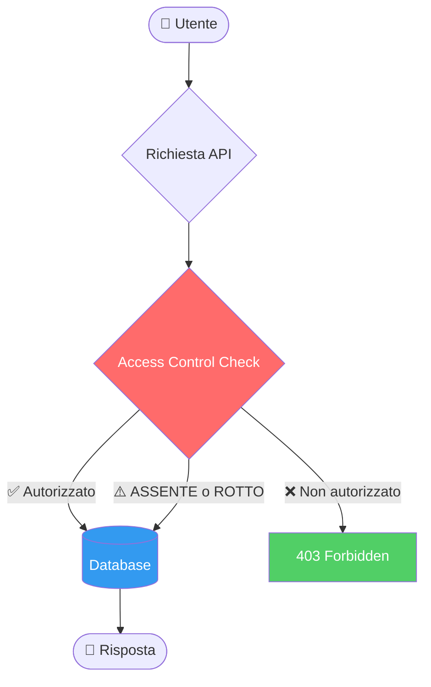
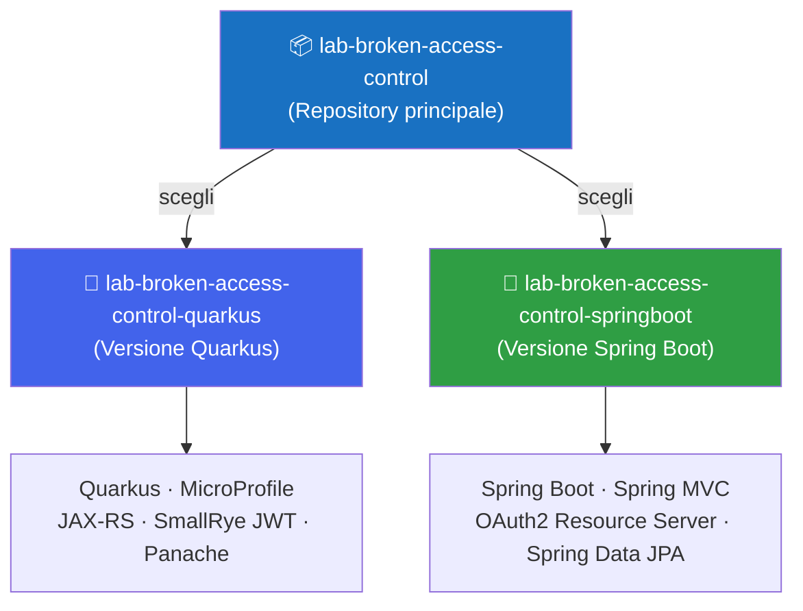

# 🔐 Broken Access Control

**Secure Code Academy** — Laboratorio pratico

<div class="pt-4 text-gray-300">
  OWASP Top 10:2025 #1 · OWASP API Security 2023 #1
</div>

<div class="abs-br m-6 flex gap-2">
  <a href="https://github.com/lab-sca/lab-broken-access-control" target="_blank" 
     class="text-xl icon-btn opacity-50 !border-none !hover:text-white">
    <carbon-logo-github />
  </a>
</div>

---
layout: default
---

# Contenuto

<div class="grid grid-cols-2 gap-6 mt-4">

<div>

### Teoria
1. 🎯 Broken Access Control: Cosa sono?
2. 📊 Dati e impatto (OWASP 2025)
3. 🔎 Tipologie di vulnerabilità
4. 🌐 OWASP API Security: BOLA
5. 🛡️ Remediation & Best Practice

</div>

<div>

### Pratica
6. 🧪 Struttura del laboratorio
7. 💻 Le 6 vulnerabilità del lab
8. 🔴/✅ Vuln (1) — ID Enumeration
9. 🔴/✅ Vuln (2) — Privilege Escalation (Data)
10. 🔴/✅ Vuln (3) — Privilege Escalation (Action)
11. 🔴/✅ Vuln (4) — Broken Object Authorization
12. 🔴/✅ Vuln (5) — Missing Authentication
13. 🎁/✅ Vuln (X) — Hidden Vulnerability
14. ✅ Approccio TDD & Verifica

</div>

</div>

---
layout: section
---

# Broken Access Control:

# Cosa Sono?

---
layout: two-cols
---

# Broken Access Control

Il controllo degli accessi garantisce che gli utenti **non possano agire al di fuori dei loro permessi previsti**.

Un fallimento di questo meccanismo porta tipicamente a:

- **Divulgazione non autorizzata** di informazioni
- **Modifica o distruzione** di dati altrui
- **Esecuzione di funzioni privilegiate** senza averne il diritto

::right::

<div style="display: flex; justify-content: center;">
<div style="transform: scale(0.7); transform-origin: top center;">



</div>
</div>

---
layout: default
---

# OWASP Top 10:2025 — #1

<div class="grid grid-cols-3 gap-4 mt-6">

<div class="bg-red-900 bg-opacity-40 rounded-lg p-4 border border-red-500">
  <div class="text-3xl font-bold text-red-400">100%</div>
  <div class="text-sm mt-1">delle applicazioni testate presenta qualche forma di BAC</div>
</div>

<div class="bg-orange-900 bg-opacity-40 rounded-lg p-4 border border-orange-500">
  <div class="text-3xl font-bold text-orange-400">1.8M+</div>
  <div class="text-sm mt-1">occorrenze rilevate nei dati raccolti</div>
</div>

<div class="bg-yellow-900 bg-opacity-40 rounded-lg p-4 border border-yellow-500">
  <div class="text-3xl font-bold text-yellow-400">32.654</div>
  <div class="text-sm mt-1">CVE correlati — il secondo numero più alto in assoluto</div>
</div>

</div>

<div class="mt-6 text-sm text-gray-400">

| Metrica | Valore |
|--------|--------|
| CWE mappate | 40 |
| Max Incidence Rate | 20,15% |
| Avg Weighted Exploit | 7,04 / 10 |
| Avg Weighted Impact | 3,84 / 10 |

</div>

<div class="mt-4 text-xs text-gray-500">
  Fonte: <a href="https://owasp.org/Top10/2025/A01_2025-Broken_Access_Control/" class="text-blue-400">OWASP Top 10:2025 — A01</a>
</div>

---
layout: default
---

# Tipologie di Vulnerabilità

<div class="grid grid-cols-2 gap-4 mt-2 text-sm">

<div class="bg-gray-800 rounded-lg p-3 border-l-4 border-red-500">
  <div class="font-bold text-red-400">🔓 Violazione del Least Privilege</div>
  <div class="mt-1 text-gray-300">Risorse accessibili a chiunque invece che solo agli utenti autorizzati</div>
</div>

<div class="bg-gray-800 rounded-lg p-3 border-l-4 border-orange-500">
  <div class="font-bold text-orange-400">🔗 IDOR — Insecure Direct Object Reference</div>
  <div class="mt-1 text-gray-300">Accedere all'account altrui modificando un ID nella richiesta</div>
</div>

<div class="bg-gray-800 rounded-lg p-3 border-l-4 border-yellow-500">
  <div class="font-bold text-yellow-400">🚀 Privilege Escalation</div>
  <div class="mt-1 text-gray-300">Agire come utente non autenticato, o ottenere privilegi admin senza averne diritto</div>
</div>

<div class="bg-gray-800 rounded-lg p-3 border-l-4 border-purple-500">
  <div class="font-bold text-purple-400">🌐 CORS Misconfiguration</div>
  <div class="mt-1 text-gray-300">Configurazione errata che permette accesso API da origini non autorizzate</div>
</div>

<div class="bg-gray-800 rounded-lg p-3 border-l-4 border-blue-500">
  <div class="font-bold text-blue-400">🔑 JWT / Metadata Manipulation</div>
  <div class="mt-1 text-gray-300">Replay o tampering di token JWT per elevare i propri privilegi</div>
</div>

<div class="bg-gray-800 rounded-lg p-3 border-l-4 border-green-500">
  <div class="font-bold text-green-400">🗺️ Force Browsing</div>
  <div class="mt-1 text-gray-300">Accedere direttamente a URL privilegiati senza autenticazione</div>
</div>

</div>

---
layout: two-cols
---

# BOLA — Perché le API sono a rischio

Le API sono particolarmente vulnerabili perché:

- Il server **non traccia lo stato** del client
- Le decisioni di accesso si basano su **parametri inviati dal client** (object ID, VIN, documentId...)
- La risposta HTTP è spesso **sufficiente** per capire se l'attacco ha avuto successo

<br>

> **BOLA ≠ BFLA**  
> In BOLA l'endpoint è accessibile, il problema è a livello di **oggetto**.  
> In BFLA (API5) l'utente non dovrebbe accedere all'endpoint stesso.

::right::

### Scenario reale

```http
# Utente autenticato accede al proprio profilo
GET /api/v1/users/1337/profile
Authorization: Bearer eyJ...

# Attaccante prova ad accedere ad altri utenti
GET /api/v1/users/1338/profile  ← ID modificato
GET /api/v1/users/1/profile     ← Prova admin!
Authorization: Bearer eyJ...    ← Stesso token!
```

<br>

**Rischi concreti:**
- Data breach
- Manipolazione dati altrui
- Account takeover completo

---
layout: default
---

# Come Prevenire il BAC

<div class="grid grid-cols-2 gap-4 mt-2 text-sm">

<div class="bg-green-900 bg-opacity-30 rounded-lg p-4 border border-green-600">

### ✅ Lato Server
- **Deny by default**: nega tutto ciò che non è esplicitamente permesso
- Implementa i controlli di accesso **una sola volta** e riusali
- Valida che l'utente sia il proprietario della risorsa (**record ownership**)
- Centralizza la logica di autorizzazione (no duplicazioni!)

</div>

<div class="bg-blue-900 bg-opacity-30 rounded-lg p-4 border border-blue-600">

### 🔑 Gestione Token e Sessioni
- Invalida i session token **lato server** al logout
- Usa JWT **short-lived** (breve durata)
- Per JWT long-lived: usa **refresh token** con revoca OAuth2
- Non basarti mai su claim del token senza validarli

</div>

<div class="bg-purple-900 bg-opacity-30 rounded-lg p-4 border border-purple-600">

### 🌐 API & CORS
- Disabilita il **directory listing** del server
- Minimizza l'uso di CORS, configura allowed origins in modo restrittivo
- Applica **rate limiting** su endpoint API e controller
- Rimuovi backup e metadata (.git) dalla web root

</div>

<div class="bg-yellow-900 bg-opacity-30 rounded-lg p-4 border border-yellow-600">

### 🧪 Test & Monitoring
- Scrivi **unit e integration test** per il controllo accessi
- **Logga** ogni fallimento di accesso e avvisa gli admin
- Usa **GUID casuali** come ID degli oggetti (non ID sequenziali!)
- Includi test di autorizzazione nelle pipeline CI/CD

</div>

</div>

---
layout: section
---

# Il Laboratorio Pratico

---
layout: default
---

# Struttura del Laboratorio

<div style="display: flex; justify-content: center;">
<div style="transform: scale(0.75); transform-origin: top center;">



</div>
</div>

<div class="mt-2 text-sm text-gray-400 text-center">
  Repository principale: <a href="https://github.com/lab-sca/lab-broken-access-control" class="text-blue-400">github.com/lab-sca/lab-broken-access-control</a>
</div>

---
layout: default
---

# Le 6 Vulnerabilità del Laboratorio

<div class="mt-4 text-sm">

| # | Tipo | Classificazione | Endpoint |
|---|------|-----------------|----------|
| **(1)** | ID Enumeration | IDOR | `GET /person/find/{id}` |
| **(2)** | Privilege Escalation — Dati | BOLA | `GET /doc/example.md` · `/doc/person/list` |
| **(3)** | Privilege Escalation — Azione | BOLA | `DELETE /doc/person/delete/{id}` |
| **(4)** | Broken Object Authorization | BOLA | `GET /doc/person/find/{id}` |
| **(5)** | Missing Authentication | Access Control | `GET /doc/example.md` |
| **(X)** | 🎁 Hidden Vulnerability (BONUS) | Access Control | `PUT /person/add` |

</div>

<div class="mt-5 grid grid-cols-2 gap-3 text-xs">
<div class="bg-gray-800 rounded p-3 border border-gray-600">
  📄 <strong>File da modificare:</strong><br/>
  <code>DocResource.java</code> · <code>PersonResource.java</code> · <code>PersonRepository.java</code>
</div>
<div class="bg-gray-800 rounded p-3 border border-gray-600">
  🧪 <strong>Test di riferimento:</strong><br/>
  <code>DocResourceSicurezzaTest.java</code>
</div>
</div>

<div class="mt-3 bg-blue-900 bg-opacity-30 rounded-lg p-3 border border-blue-600 text-xs">
  💡 Ogni vulnerabilità fa fallire almeno un test. La <strong>(2)</strong> ne fa fallire 2. La <strong>(X)</strong> non è coperta dai test — trovala tu!
</div>

---
layout: section
---

# Vuln (1) — ID Enumeration
## IDOR · `GET /person/find/{id}`

---
layout: default
---

# Vuln (1) — ID Enumeration <span class="text-sm font-normal text-red-400 ml-2">❌ Codice Vulnerabile</span>

**Il problema:** restituendo `404` per ID inesistenti e `403` per ID esistenti ma non autorizzati, un attaccante può enumerare gli ID validi nel database.

```http
GET /person/999   → 404 Not Found   ← questo ID non esiste
GET /person/10002 → 403 Forbidden   ← questo ID esiste! 😱
```

**File:** `PersonResource.java`

```java {5}
@GET
@Path("/person/find/{id}")
@RolesAllowed({ "admin", "user" })
@Transactional
public Response findPerson(@PathParam("id") Long id) {
    Person person = this.personRepository.findById(id);
    if (person == null) {
        return Response.status(Response.Status.NOT_FOUND).build(); // ← rivela l'esistenza dell'oggetto!
    } else {
        return Response.status(Response.Status.OK).entity(person.toDTO()).build();
    }
}
```

<div class="mt-4 bg-red-900 bg-opacity-20 rounded p-3 text-xs border border-red-800">
  🎯 <strong>Tecnica di attacco:</strong> iterare sugli ID e distinguere <code>404</code> da <code>403</code> per costruire una mappa completa degli oggetti esistenti nel database.
</div>

---
layout: default
---

# Vuln (1) — ID Enumeration <span class="text-sm font-normal text-green-400 ml-2">✅ Soluzione</span>

**La fix:** restituire sempre `403 FORBIDDEN` indipendentemente dal fatto che l'oggetto esista o meno, rendendo impossibile l'enumerazione.

**File:** `PersonResource.java`

```java {7,8}
@GET
@Path("/person/find/{id}")
@RolesAllowed({ "admin", "user" })
@Transactional
public Response findPerson(@PathParam("id") Long id) {
    Person person = this.personRepository.findById(id);
    if (person == null) {
        // SOLUTION (1): restituiamo FORBIDDEN invece di NOT_FOUND
        // per non rendere gli oggetti enumerabili
        return Response.status(Response.Status.FORBIDDEN).build();
    } else {
        return Response.status(Response.Status.OK).entity(person.toDTO()).build();
    }
}
```

<div class="mt-4 bg-green-900 bg-opacity-20 rounded p-3 text-xs border border-green-800">
  ✅ <strong>Principio applicato:</strong> un utente non autorizzato non deve sapere se una risorsa esiste o meno — la risposta deve essere identica in entrambi i casi.
</div>

---
layout: section
---

# Vuln (2) — Privilege Escalation (Data)
## BOLA · `GET /doc/person/list`

---
layout: default
---

# Vuln (2) — Privilege Escalation (Data) <span class="text-sm font-normal text-red-400 ml-2">❌ Codice Vulnerabile</span>

**Il problema:** `findByRolesOrderedByName()` riceve i ruoli dell'utente come parametro ma **li ignora completamente nella query**, restituendo tutti i record senza filtro.

**File:** `PersonRepository.java`

```java {5,6,7}
/**
 * Restituisce l'elenco delle persone ordinate per cognome e nome,
 * filtrate per MIN_ROLE (NULL oppure presente nella collection di ruoli fornita)
 */
public List<Person> findByRolesOrderedByName(Collection<String> roles) {
    // Il parametro 'roles' è ricevuto ma completamente ignorato!
    return find("order by lastName, firstName").list();
}
```

<div class="mt-4 bg-red-900 bg-opacity-20 rounded p-3 text-xs border border-red-800">
  🎯 <strong>Effetto:</strong> un utente con ruolo <code>user</code> vede anche le persone con <code>minRole=admin</code> (es. Richard Feynman).<br/>
  ⚠️ Questa vulnerabilità fa fallire <strong>2 casi di test</strong>: uno per il formato MD e uno per HTML.
</div>

---
layout: default
---

# Vuln (2) — Privilege Escalation (Data) <span class="text-sm font-normal text-green-400 ml-2">✅ Soluzione</span>

**La fix:** usare il parametro `roles` come filtro nella query Panache, includendo solo le persone con `minRole` nullo (visibili a tutti) o corrispondente ai ruoli dell'utente.

**File:** `PersonRepository.java`

```java {5,6,7,8}
/**
 * Restituisce l'elenco delle persone ordinate per cognome e nome,
 * filtrate per MIN_ROLE (NULL oppure presente nella collection di ruoli fornita)
 */
public List<Person> findByRolesOrderedByName(Collection<String> roles) {
    // SOLUTION (2): usiamo 'roles' come filtro nella query.
    // minRole null = visibile a tutti i ruoli autenticati
    return find("minRole is null or minRole in ?1 order by lastName, firstName", roles).list();
}
```

<div class="mt-4 bg-green-900 bg-opacity-20 rounded p-3 text-xs border border-green-800">
  ✅ <strong>Principio applicato:</strong> il filtraggio dei dati in base ai ruoli deve avvenire <strong>lato server nella query</strong>, non affidarsi al client o a logica applicativa successiva.
</div>

---
layout: section
---

# Vuln (3) — Privilege Escalation (Action)
## BOLA · `DELETE /doc/person/delete/{id}`

---
layout: default
---

# Vuln (3) — Privilege Escalation (Action) <span class="text-sm font-normal text-red-400 ml-2">❌ Codice Vulnerabile</span>

**Il problema:** `@RolesAllowed` include erroneamente il ruolo `user`, permettendo a qualsiasi utente autenticato di **cancellare** persone — operazione che dovrebbe essere riservata solo agli `admin`.

**File:** `DocResource.java`

```java {4}
@DELETE
@Path("/person/delete/{id}")
@RolesAllowed({ "admin", "user" }) // ← 'user' non dovrebbe poter cancellare!
@Transactional
public Response deletePerson(@PathParam("id") Long id) {
    Person person = this.personRepository.findById(id);
    if (person == null) {
        return Response.status(Response.Status.FORBIDDEN).build();
    }
    person.delete();
    return Response.status(Response.Status.OK).build();
}
```

<div class="mt-4 bg-red-900 bg-opacity-20 rounded p-3 text-xs border border-red-800">
  🎯 <strong>Principio violato:</strong> Least Privilege — un utente ha ottenuto più permessi di quelli necessari al suo ruolo, probabilmente per un errore di copia-incolla dell'annotazione.
</div>

---
layout: default
---

# Vuln (3) — Privilege Escalation (Action) <span class="text-sm font-normal text-green-400 ml-2">✅ Soluzione</span>

**La fix:** rimuovere `"user"` da `@RolesAllowed`, lasciando solo `"admin"` come da specifiche.

**File:** `DocResource.java`

```java {4,5}
@DELETE
@Path("/person/delete/{id}")
// SOLUTION (3): rimuoviamo il ruolo 'user'.
// Secondo le specifiche, la cancellazione è consentita solo ad 'admin'
@RolesAllowed({ "admin" })
@Transactional
public Response deletePerson(@PathParam("id") Long id) {
    Person person = this.personRepository.findById(id);
    if (person == null) {
        return Response.status(Response.Status.FORBIDDEN).build();
    }
    person.delete();
    return Response.status(Response.Status.OK).build();
}
```

<div class="mt-4 bg-green-900 bg-opacity-20 rounded p-3 text-xs border border-green-800">
  ✅ <strong>Buona pratica:</strong> ogni operazione distruttiva (DELETE, modifica dati critici) dovrebbe richiedere una revisione esplicita dei ruoli autorizzati, separata dalla logica di lettura.
</div>

---
layout: section
---

# Vuln (4) — Broken Object Authorization
## BOLA · `GET /doc/person/find/{id}`

---
layout: default
---

# Vuln (4) — Broken Object Authorization <span class="text-sm font-normal text-red-400 ml-2">❌ Codice Vulnerabile</span>

**Il problema:** anche se l'utente è autenticato e autorizzato all'endpoint, non viene verificato se possiede il ruolo minimo richiesto **dalla singola risorsa** (`person.getMinRole()`). Contiene anche la vuln (1).

**File:** `DocResource.java`

```java {7,9,10}
@GET
@Path("/person/find/{id}")
@RolesAllowed({ "admin", "user" })
@Transactional
public Response findPerson(@PathParam("id") Long id) {
    Person person = this.personRepository.findById(id);
    if (person == null) {
        return Response.status(Response.Status.NOT_FOUND).build(); // ← vuln (1): enumerable!
    } else {
        // Nessun controllo su person.getMinRole() vs ruoli dell'utente!
        return Response.status(Response.Status.OK).entity(person.toDTO()).build();
    }
}
```

<div class="mt-4 bg-red-900 bg-opacity-20 rounded p-3 text-xs border border-red-800">
  🎯 <strong>Effetto:</strong> un utente <code>user</code> può leggere dati di persone con <code>minRole=admin</code> conoscendone l'ID diretto, anche se la lista è filtrata correttamente (vuln 2).
</div>

---
layout: default
---

# Vuln (4) — Broken Object Authorization <span class="text-sm font-normal text-green-400 ml-2">✅ Soluzione</span>

**La fix:** verificare che i ruoli dell'utente autenticato contengano il `minRole` richiesto dalla risorsa. Questa soluzione ingloba anche la fix della vuln (1).

**File:** `DocResource.java`

```java {8,10,11,12,13,14,15}
@GET
@Path("/person/find/{id}")
@RolesAllowed({ "admin", "user" })
@Transactional
public Response findPerson(@PathParam("id") Long id) {
    Person person = this.personRepository.findById(id);
    if (person == null) {
        // SOLUTION (1): FORBIDDEN invece di NOT_FOUND — oggetti non enumerabili
        return Response.status(Response.Status.FORBIDDEN).build();
    } else {
        // SOLUTION (4): verifica se l'utente ha il ruolo minimo richiesto dalla risorsa
        if (person.getMinRole() == null || this.securityIdentity.getRoles().contains(person.getMinRole())) {
            return Response.status(Response.Status.OK).entity(person.toDTO()).build();
        } else {
            return Response.status(Response.Status.FORBIDDEN).build();
        }
    }
}
```

<div class="mt-4 bg-blue-900 bg-opacity-20 rounded p-3 text-xs border border-blue-800">
  💡 La soluzione della (4) incorpora anche la fix della (1) — i due problemi vivono nello stesso metodo.
</div>

---
layout: section
---

# Vuln (5) — Missing Authentication
## Access Control · `GET /doc/example.md`

---
layout: default
---

# Vuln (5) — Missing Authentication <span class="text-sm font-normal text-red-400 ml-2">❌ Codice Vulnerabile</span>

**Il problema:** il metodo ha `@SecurityRequirement` (visibilità Swagger) ma **manca completamente di `@RolesAllowed`**, rendendolo accessibile senza alcuna autenticazione.

**File:** `DocResource.java`

```java {4,5,6}
@GET
@Path("/example.md")
@SecurityRequirement(name = "SecurityScheme")
// @RolesAllowed mancante!
// @SecurityRequirement documenta solo l'endpoint in Swagger
// ma NON applica alcun controllo di sicurezza reale
public Response markdownExample() throws IOException {
    return Response.status(Response.Status.OK)
                   .entity(processDocument(DocConfig.TYPE_MD))
                   .build();
}
```

<div class="mt-4 bg-red-900 bg-opacity-20 rounded p-3 text-xs border border-red-800">
  ⚠️ <strong>Errore comune:</strong> confondere <code>@SecurityRequirement</code> (documentazione OpenAPI) con <code>@RolesAllowed</code> (controllo di sicurezza reale). Il primo non protegge nulla.
</div>

---
layout: default
---

# Vuln (5) — Missing Authentication <span class="text-sm font-normal text-green-400 ml-2">✅ Soluzione</span>

**La fix:** aggiungere `@RolesAllowed` con i ruoli previsti dalle specifiche. Il ruolo `guest` è il minimo richiesto per accedere al documento.

**File:** `DocResource.java`

```java {4,5,6}
@GET
@Path("/example.md")
@SecurityRequirement(name = "SecurityScheme")
// SOLUTION (5): aggiungiamo i ruoli autorizzati previsti dalle specifiche.
// 'guest' è il ruolo minimo — il path non è ad accesso pubblico
@RolesAllowed({ "admin", "user", "guest" })
public Response markdownExample() throws IOException {
    return Response.status(Response.Status.OK)
                   .entity(processDocument(DocConfig.TYPE_MD))
                   .build();
}
```

<div class="mt-4 bg-green-900 bg-opacity-20 rounded p-3 text-xs border border-green-800">
  ✅ <strong>Regola generale:</strong> ogni endpoint deve avere esplicitamente <code>@RolesAllowed</code>. Se un endpoint deve essere pubblico, va dichiarato esplicitamente con <code>@PermitAll</code>, non semplicemente omettendo l'annotazione.
</div>

---
layout: section
---

# Vuln (X) — Hidden Vulnerability 🎁
## BONUS · `PUT /person/add`

---
layout: default
---

# Vuln (X) — Hidden Vulnerability 🎁 <span class="text-sm font-normal text-red-400 ml-2">❌ Codice Vulnerabile</span>

**Il problema:** un metodo `PUT` alternativo per aggiungere persone è rimasto attivo **senza alcun controllo di autenticazione o autorizzazione**. Non è censito nei test — va trovato analizzando il codice.

**File:** `PersonResource.java`

```java
@APIResponse(responseCode = "201", description = "La persona è stata creata")
@APIResponse(responseCode = "401", description = "Se l'autenticazione non è presente")
@APIResponse(responseCode = "403", description = "Se l'utente non è autorizzato per la risorsa")
@Tag(name = "person")
@Operation(operationId = "addPersonPut", summary = "Aggiunge una persona al database (ruoli: admin)")
@PUT
@Path("/person/add")
@Transactional
// Nessun @RolesAllowed — nessun @SecurityRequirement
// Chiunque, anche non autenticato, può aggiungere persone!
public Response addPersonPut(AddPersonRequestDTO request) {
    return this.addPerson(request);
}
```

<div class="mt-3 bg-red-900 bg-opacity-20 rounded p-2 text-xs border border-red-800">
  🎁 <strong>Nota:</strong> persino la documentazione OpenAPI dichiara <code>401</code> e <code>403</code> come risposte possibili... ma senza <code>@RolesAllowed</code> non verranno mai restituite!
</div>

---
layout: default
---

# Vuln (X) — Hidden Vulnerability 🎁 <span class="text-sm font-normal text-green-400 ml-2">✅ Soluzione</span>

**La fix:** rimuovere completamente il metodo. Esiste già `addPersonPost()` con i controlli di sicurezza appropriati — `addPersonPut()` è un duplicato dimenticato.

**File:** `PersonResource.java`

```java
// SOLUTION (X): una PUT senza controllo di autorizzazione
// è rimasta abilitata per errore.
//
// La soluzione corretta è rimuovere totalmente il metodo addPersonPut().
// Esiste già addPersonPost() con @RolesAllowed({ "admin" }) che svolge
// la stessa funzione in modo sicuro.
//
// ← metodo rimosso
```

<div class="mt-6 bg-purple-900 bg-opacity-20 rounded p-3 text-sm border border-purple-800">
  🎁 <strong>Lezione:</strong> le API dimenticate o duplicate sono tra le vulnerabilità più insidiose — difficili da trovare senza una revisione sistematica del codice o un inventario degli endpoint. Strumenti come Swagger UI o test di superficie API aiutano a scoprirle.
</div>

---
layout: default
---

# Approccio TDD: prima i test, poi il codice

Il laboratorio segue il **Test-Driven Development**: i test di sicurezza sono scritti prima e **falliscono** finché le vulnerabilità non vengono corrette.

<div class="grid grid-cols-2 gap-4 mt-4">

<div class="text-center">

### ❌ Prima della fix

```bash
mvn test
```

<div class="bg-red-900 bg-opacity-30 border border-red-700 rounded p-3 mt-2 text-xs font-mono text-left">
Tests run: 11, Failures: 6<br/>
<br/>
<span class="text-red-400">FAIL</span> testFindPersonUser<br/>
<span class="text-red-400">FAIL</span> testListPersonUser<br/>
<span class="text-red-400">FAIL</span> testListPersonUserHtml<br/>
<span class="text-red-400">FAIL</span> testDeletePersonUser<br/>
<span class="text-red-400">FAIL</span> testFindPersonDocUser<br/>
<span class="text-red-400">FAIL</span> testMarkdownGuest
</div>

</div>

<div class="text-center">

### ✅ Dopo la fix

```bash
mvn test
```

<div class="bg-green-900 bg-opacity-30 border border-green-700 rounded p-3 mt-2 text-xs font-mono text-left">
Tests run: 11, Failures: 0<br/>
<br/>
<span class="text-green-400">PASS</span> testFindPersonUser<br/>
<span class="text-green-400">PASS</span> testListPersonUser<br/>
<span class="text-green-400">PASS</span> testListPersonUserHtml<br/>
<span class="text-green-400">PASS</span> testDeletePersonUser<br/>
<span class="text-green-400">PASS</span> testFindPersonDocUser<br/>
<span class="text-green-400">PASS</span> testMarkdownGuest
</div>

</div>

</div>

---
layout: default
---

# Come Affrontare il Laboratorio

<div class="grid grid-cols-3 gap-4 mt-4 text-center text-sm">

<div class="bg-gray-800 rounded-xl p-4">
  <div class="text-3xl mb-2">1️⃣</div>
  <div class="font-bold text-blue-400">Setup</div>
  <div class="mt-2 text-gray-300 text-xs">
    Clona il repo e avvia con <code>mvn quarkus:dev</code>. Esegui i test: vedrai 6 fallimenti.
  </div>
</div>

<div class="bg-gray-800 rounded-xl p-4">
  <div class="text-3xl mb-2">2️⃣</div>
  <div class="font-bold text-yellow-400">Analizza & Attacca</div>
  <div class="mt-2 text-gray-300 text-xs">
    Cerca i commenti <code>// VULNERABILITY: (n)</code>. Prova a sfruttare ogni falla con curl o Swagger UI.
  </div>
</div>

<div class="bg-gray-800 rounded-xl p-4">
  <div class="text-3xl mb-2">3️⃣</div>
  <div class="font-bold text-green-400">Correggi & Verifica</div>
  <div class="mt-2 text-gray-300 text-xs">
    Applica le fix una alla volta. Riesegui i test finché tutti e 11 passano. Poi cerca la (X)!
  </div>
</div>

</div>

<div class="mt-5 grid grid-cols-2 gap-3 text-xs">

<div class="bg-gray-800 rounded p-3 border-l-4 border-blue-500">
  <strong class="text-blue-400">File da modificare</strong><br/>
  <code>PersonResource.java</code> — vuln 1, X<br/>
  <code>PersonRepository.java</code> — vuln 2<br/>
  <code>DocResource.java</code> — vuln 3, 4, 5
</div>

<div class="bg-gray-800 rounded p-3 border-l-4 border-green-500">
  <strong class="text-green-400">Come verificare le soluzioni</strong><br/>
  Cerca: <code>// VULNERABILITY: (n)</code> nel codice<br/>
  Confronta con il branch <code>solution</code><br/>
  oppure cerca: <code>// SOLUTION: (n)</code>
</div>

</div>

---
layout: default
---

# Riferimenti e Risorse

<div class="grid grid-cols-2 gap-4 mt-4 text-sm">

<div>

### OWASP
- [OWASP Top 10:2025 — A01 Broken Access Control](https://owasp.org/Top10/2025/A01_2025-Broken_Access_Control/)
- [OWASP API Security 2023 — API1 BOLA](https://owasp.org/API-Security/editions/2023/en/0xa1-broken-object-level-authorization/)
- [OWASP Authorization Cheat Sheet](https://cheatsheetseries.owasp.org/cheatsheets/Authorization_Cheat_Sheet.html)
- [OWASP Proactive Controls: C1 Access Control](https://top10proactive.owasp.org/archive/2024/the-top-10/c1-accesscontrol/)
- [OWASP ASVS V8 Authorization](https://github.com/OWASP/ASVS/blob/master/5.0/en/0x17-V8-Authorization.md)

</div>

<div>

### Laboratorio
- [📦 Repository principale](https://github.com/lab-sca/lab-broken-access-control)
- [🔷 Lab Quarkus](https://github.com/lab-sca/lab-broken-access-control-quarkus)
- [🍃 Lab Spring Boot](https://github.com/lab-sca/lab-broken-access-control-springboot)

### Strumenti Utili
- [Fugerit Venus Doc](https://venusdocs.fugerit.org/)
- [PortSwigger Web Academy — Access Control](https://portswigger.net/web-security/access-control)
- [OAuth 2.0 — Revoking Access](https://www.oauth.com/oauth2-servers/listing-authorizations/revoking-access/)

</div>

</div>

---
layout: end
---

# Buon Laboratorio! 🚀

<div class="flex gap-8 items-center justify-between mt-6">

  <div class="flex-1">
    <div class="text-gray-400 mt-2">
      Domande? Apri una issue su <strong>GitHub</strong>
    </div>
    <div class="mt-4">
      <a href="https://github.com/lab-sca/lab-broken-access-control"
         class="text-blue-400 hover:text-blue-300 text-sm">
        🔗 github.com/lab-sca/lab-broken-access-control
      </a>
    </div>
    <div class="mt-8 text-xs text-gray-600">
      Basato su OWASP Top 10:2025 · OWASP API Security Top 10:2023 · Licenza MIT
    </div>
  </div>

  <div class="flex-1 flex flex-col items-center justify-center">
    
    <div class="text-xs text-gray-500 mt-2 text-center">
      github.com/lab-sca/lab-broken-access-control
    </div>
  </div>

</div>
